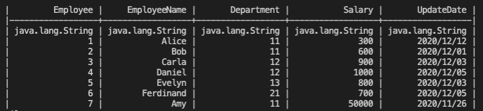
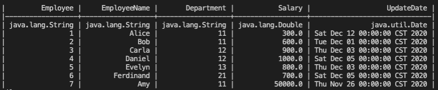
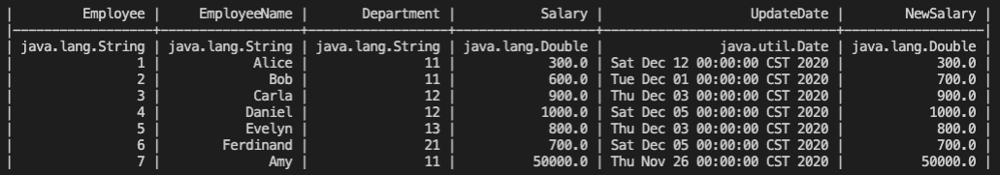
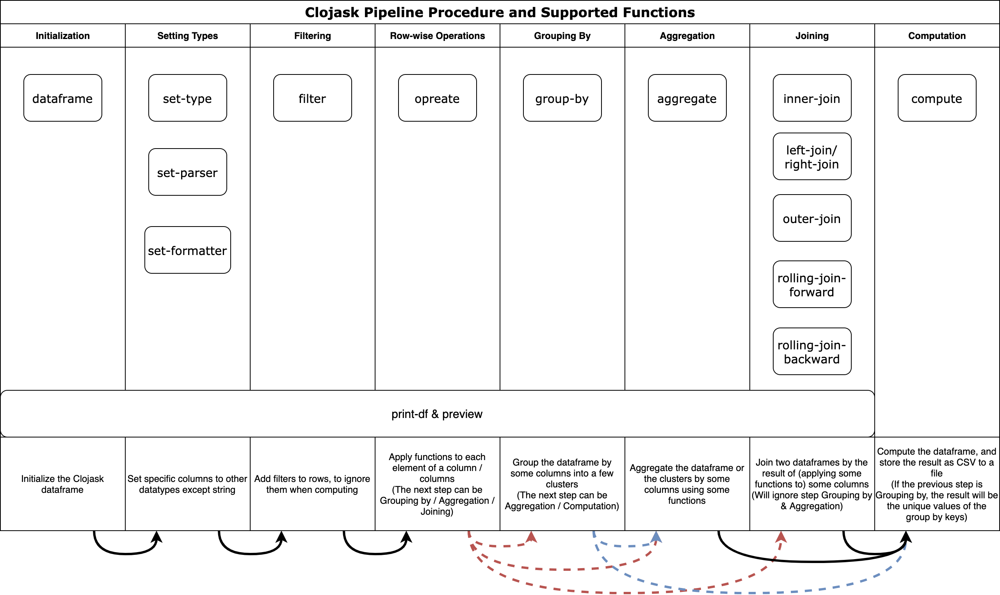

# Clojask
> Clojure data processing framework with parallel computing on larger-than-memory datasets

### Features

- **Unlimited size**

  It supports datasets larger than memory!

- **Various Operations**

  Although Clojask is designed for larger-than-memory datasets, like NoSQLs, it does not sacrifice common operations on relational dataframes, such as [group by](https://clojure-finance.github.io/clojask-website/posts-output/API/#group-by), [aggregate](https://clojure-finance.github.io/clojask-website/posts-output/API/#aggregate), [join](https://clojure-finance.github.io/clojask-website/posts-output/API/#inner-join--left-join--right-join).

- **Fast**

  Faster than Dask in most operations, and the larger the dataframe is, the bigger the advantage. Please find the benchmarks [here](https://clojure-finance.github.io/clojask-website/pages-output/about/#benchmarks).

- **All native types**

  All the datatypes used to store data is native Clojure (or Java) types!

- **From file to file**

  Integrate IO inside the dataframe. No need to write your own read-in and output functions!

- **Parallel**

  Most operations could be executed into multiple threads or even machines. See the principle in [Onyx](http://www.onyxplatform.org/).

- **Lazy operations**

  Most operations will not be executed immediately. Dataframe will intelligently pipeline the operations altogether in computation.

### Installation

Available on [Clojars](https://clojars.org/com.github.clojure-finance/clojask). 

Insert this line into your `project.clj` if using Leiningen.

```
[com.github.clojure-finance/clojask "1.2.1"]
```

Insert this line into your `deps.edn` if using CLI.

```clojure
com.github.clojure-finance/clojask {:mvn/version "1.2.1"}
```

**Requirements:**

- MacOS / Linux
- Java 8 - 11

### Example Usage

1. Import `Clojask`

   ```clojure
   (require '[clojask.dataframe :as ck])
   ```

2. Initialize a dataframe

   ```clojure
   (def df (ck/dataframe "Employees-example.csv"))
   ```

   The source file can be found [here](https://github.com/clojure-finance/clojask/blob/1.x.x/test/clojask/Employees-example.csv).

   See [`dataframe`](https://clojure-finance.github.io/clojask-website/posts-output/API/#dataframe)

3. Preview the first few lines of the dataframe

   ```clojure
   (ck/print-df df)
   ```

   

   See [`print-df`](https://clojure-finance.github.io/clojask-website/posts-output/API/#print-df)

4. Change the data type of some columns

   ```clojure
   (ck/set-type df "Salary" "double")
   (ck/set-type df "UpdateDate" "date:yyyy/MM/dd")
   (ck/print-df df)
   ```

   

   See [`set-type`](https://clojure-finance.github.io/clojask-website/posts-output/API/#set-type)

5. Add 100 to Bob as `NewSalary`

   ```clojure
   (ck/operate df (fn [EmployeeName Salary] (if (= EmployeeName "Bob") (+ Salary 100) Salary)) ["EmployeeName" "Salary"] "NewSalary")
   (ck/print-df df)
   ```

   

   See [`operate`](https://clojure-finance.github.io/clojask-website/posts-output/API/#operate-in-place-modification)

6. Output the resultant dataset to "result.csv" (Use 8 threads)

   ```clojure
   (ck/compute df 8 "result.csv" :select ["Employee"	"EmployeeName"	"Department"	"newSalary"	"UpdateDate"])
   ```

   See [`compute`](https://clojure-finance.github.io/clojask-website/posts-output/API/#compute)

### Supported Functions and Procedures



- *The solid arrows point to the fixed next step; dotted arrows point to all possible next steps.*
- *Any step except for Initialization is optional.*

### Documentation

The detailed documentation for every API can be found [here](https://clojure-finance.github.io/clojask-website/posts-output/API/).

### Examples

A separate repository for some typical usage of Clojask can be found [here](https://github.com/clojure-finance/clojask-examples).

### Problem Feedback

If your question is not answered in existing [issues](https://github.com/clojure-finance/clojask/issues). Feel free to create a new one.
