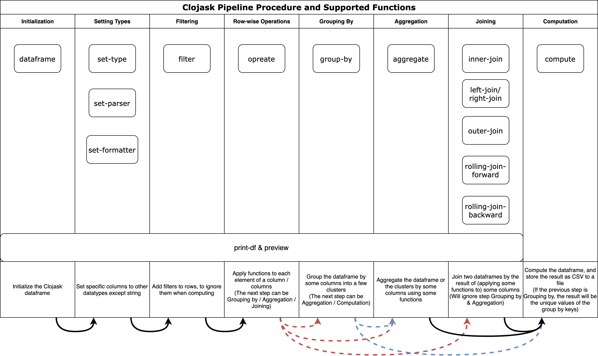

# Clojask

[](https://clojars.org/com.github.clojure-finance/clojask)
[](LICENSE)

A Clojure dataframe library for **larger-than-memory** datasets. Process millions of rows with lazy evaluation and parallel execution—all with familiar dataframe operations.

## Why Clojask?

| Feature | Description |
|---------|-------------|
| **Larger than memory** | Stream data from disk—no need to fit everything in RAM |
| **Lazy & parallel** | Operations are pipelined and executed across multiple threads |
| **Relational operations** | Filter, transform, group-by, aggregate, join, with arbitrary Clojure functions |
| **File-to-file** | Read CSV in, write CSV out, with built-in IO |
| **Native types** | Works with standard Clojure and Java types |
| **Faster than Dask** | [Benchmarks](https://clojure-finance.github.io/clojask-website/pages-output/about/#benchmarks) show significant speedups on large datasets |

## Quick Start

**Add to project.clj:**
```clojure
[com.github.clojure-finance/clojask "2.0.5"]
```

**Or deps.edn:**
```clojure
com.github.clojure-finance/clojask {:mvn/version "2.0.5"}
```

Both also need two JVM flags, see [Requirements](#requirements).

**Basic example** (using [Employees-example.csv](test/clojask/Employees-example.csv)):
```clojure
(require '[clojask.dataframe :as ck])

;; Load a CSV
(def df (ck/dataframe "Employees-example.csv"))

;; Preview the data (the second row shows each column's type)
(ck/print-df df)
;; |         Employee |     EmployeeName |       Department |           Salary |       UpdateDate |
;; |------------------+------------------+------------------+------------------+------------------|
;; | java.lang.String | java.lang.String | java.lang.String | java.lang.String | java.lang.String |
;; |                1 |            Alice |               11 |              300 |       2020/12/12 |
;; |                2 |              Bob |               11 |              600 |       2020/12/01 |
;; ...

;; Set column types
(ck/set-type df "Salary" "double")
(ck/set-type df "UpdateDate" "date:yyyy/MM/dd")

;; Transform data: give Bob a raise, as a new column
;; (an operation over several columns must write to a new column)
(ck/operate df
  (fn [name salary]
    (if (= name "Bob") (+ salary 100) salary))
  ["EmployeeName" "Salary"]
  "NewSalary")

;; Compute with 8 threads, output to file
(ck/compute df 8 "results.csv"
  :select ["Employee" "EmployeeName" "Department" "NewSalary" "UpdateDate"])
;; results.csv:
;; Employee,EmployeeName,Department,NewSalary,UpdateDate
;; 1,Alice,11,300.0,2020/12/12
;; 2,Bob,11,700.0,2020/12/01
;; ...
```

## Operations



*Solid arrows show required sequence; dotted arrows show optional paths.*

**Available operations:**
- **Create:** `dataframe`
- **Types:** `set-type`, `set-parser`, `set-formatter`
- **Columns:** `operate`, `rename-col`, `select-col`, `delete-col`, `reorder-col`, `get-col-names`
- **Filter:** `filter`
- **Group:** `group-by`, `aggregate`
- **Combine:** `inner-join`, `left-join`, `right-join`, `outer-join`, `rolling-join-forward`, `rolling-join-backward`
- **Output:** `compute` (with options such as `:select`, `:exclude`, `:melt`, `:header`), `print-df`, `preview`

`sort` stands outside this pipeline: it sorts the dataframe's source file on disk and writes the result directly to an output file.

## Requirements

- **OS:** macOS or Linux
- **JDK:** 17 or newer (tested on 17, 21, and 25)

**Required JVM flags:**
```clojure
;; project.clj
:jvm-opts ["--add-opens=java.base/jdk.internal.misc=ALL-UNNAMED"
           "--enable-native-access=ALL-UNNAMED"]

;; deps.edn, inside an alias (e.g. :aliases {:dev {...}}, run with -A:dev)
:jvm-opts ["--add-opens=java.base/jdk.internal.misc=ALL-UNNAMED"
           "--enable-native-access=ALL-UNNAMED"]
```

When running plain `java`, pass both flags on the command line.

The first flag is required for Agrona (used by Onyx's messaging). Without it the first `compute` fails with `IllegalAccessError: class org.agrona.UnsafeApi ... cannot access class jdk.internal.misc.Unsafe`. The second is for lz4's native code: JDK 24+ prints a warning without it, and a future JDK will block the load.

<details>
<summary><strong>Running multiple Clojask processes</strong></summary>

Each `compute` starts embedded ZooKeeper (port 2188) and Aeron (port 40200), with Aeron's files in the default media-driver directory (`/dev/shm` on Linux). To run multiple processes on one machine, give each different settings:

**System properties:**
- `clojask.zookeeper.port`
- `clojask.aeron.port`
- `clojask.aeron.dir`

**Or environment variables:**
- `CLOJASK_ZOOKEEPER_PORT`
- `CLOJASK_AERON_PORT`
- `CLOJASK_AERON_DIR`

</details>

<details>
<summary><strong>Logging</strong></summary>

Onyx writes warnings and errors to `.clojask/clojask.log` in the working directory, rotated at 10 MB with one backup.

</details>

## Documentation

- **[API Reference](https://clojure-finance.github.io/clojask-website/posts-output/API/)** — Full documentation for all functions
- **[Examples Repository](https://github.com/clojure-finance/clojask-examples)** — Real-world usage patterns
- **[Aggregation Functions](docs/aggregation%20functions.md)** — Built-in and custom aggregations
- **[Type System](docs/clojask%20types.md)** — Supported data types and parsing

## How It Works

Clojask uses [Onyx](https://github.com/clojure-finance/onyx) (a maintained fork) as a single-machine thread pool. Operations are collected lazily and executed together when you call `compute`, streaming data through your transformation pipeline without loading the full dataset into memory.

## Issues & Feedback

Found a bug or have a question? Check the [existing issues](https://github.com/clojure-finance/clojask/issues) or open a new one.

## License

[MIT](LICENSE)
